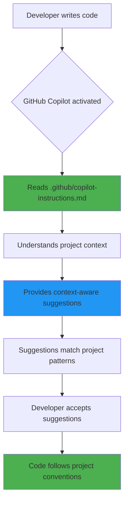
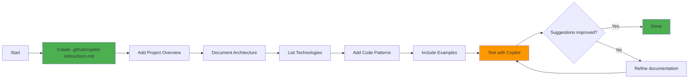
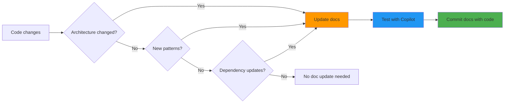
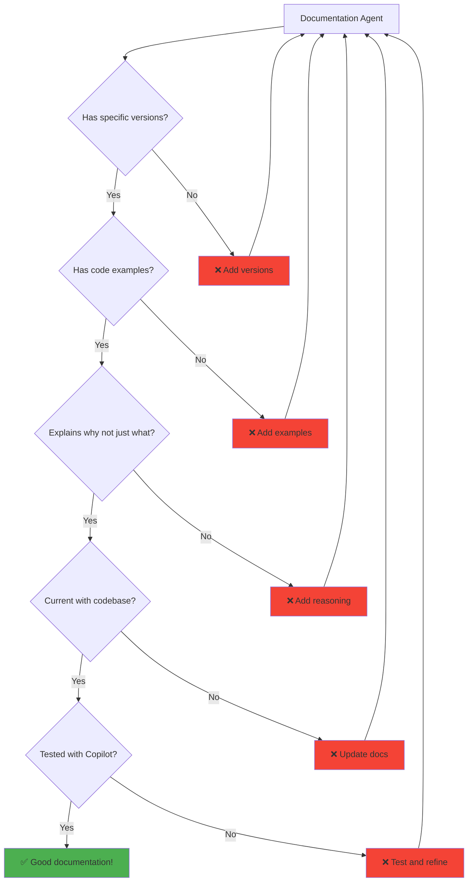
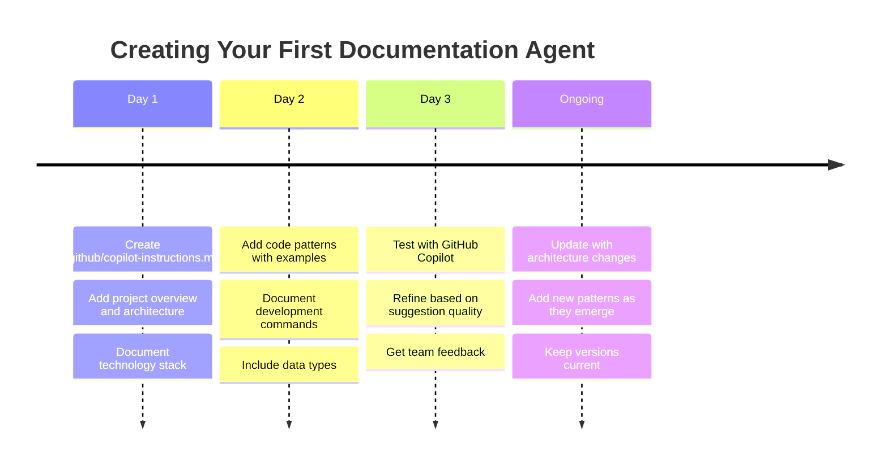
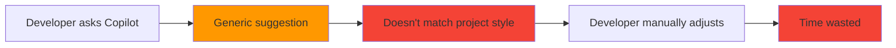

# Documentation Agent Workflow

This document provides visual guides for understanding and creating documentation agents.

## How GitHub Copilot Uses Documentation Agents



## Creating a Documentation Agent



## Documentation Agent Structure

```mermaid
graph TD
    A[Documentation Agent] --> B[Project Overview]
    A --> C[Core Architecture]
    A --> D[Technology Stack]
    A --> E[Code Patterns]
    A --> F[Development Workflows]
    
    B --> B1[What the project does]
    B --> B2[Target users]
    B --> B3[Key features]
    
    C --> C1[Directory structure]
    C --> C2[Component organization]
    C --> C3[Data flow]
    
    D --> D1[Frameworks & versions]
    D --> D2[Libraries & config]
    D --> D3[Language patterns]
    
    E --> E1[Common patterns]
    E --> E2[Code examples]
    E --> E3[Error handling]
    
    F --> F1[Commands]
    F --> F2[Testing approach]
    F --> F3[Deployment]
    
    style A fill:#2196F3
    style B fill:#4CAF50
    style C fill:#4CAF50
    style D fill:#4CAF50
    style E fill:#4CAF50
    style F fill:#4CAF50
```



## Documentation Quality Levels

### Level 1: Basic (Minimal but Functional)

```markdown
# Project Instructions

## Overview
[Name] is a [type] app using [tech]. It does [purpose].

## Stack
- Framework: [Name]
- Language: [Name]

## Commands
\`\`\`bash
npm run dev    # Start
npm test       # Test
\`\`\`
```

**Copilot Benefit**: Basic context, generic suggestions

### Level 2: Intermediate (Good Context)

```markdown
# Project Instructions

## Overview
[Detailed description with users and goals]

## Architecture
\`\`\`text
src/
├── feature1/  # Description
└── feature2/  # Description
\`\`\`

## Stack
- Framework: [Name] [version] with [config]
- Language: [Name] + [when to use]

## Patterns
### Error Handling
\`\`\`typescript
// Example pattern
\`\`\`

## Commands
[Comprehensive list]
```

**Copilot Benefit**: Good context, pattern-aware suggestions

### Level 3: Advanced (Comprehensive)

```markdown
# Project Instructions

## Overview
[Detailed with specific use cases and technical details]

## Architecture
[Detailed structure with inline comments]
[Data flow diagrams]
[Integration points]

## Stack
[Versions, configs, and rationale]

## Patterns
[Multiple patterns with examples]
[Helper functions documented]
[Error handling strategies]

## Data Types
[Complete type definitions]

## Development
[Prerequisites, commands, workflows]

## Testing
[Approach, tools, conventions]
```

**Copilot Benefit**: Excellent context, highly accurate project-specific suggestions

## Maintenance Workflow



## Best Practices Checklist



## Quick Start Visual Guide



## Impact Comparison

### Before Documentation Agent



### After Documentation Agent


## Resources

- **Complete Guide**: [DOCUMENTATION_AGENT_GUIDE.md](DOCUMENTATION_AGENT_GUIDE.md)
- **Template**: [DOCUMENTATION_AGENT_TEMPLATE.md](DOCUMENTATION_AGENT_TEMPLATE.md)
- **Quick Reference**: [DOCUMENTATION_AGENT_QUICKREF.md](DOCUMENTATION_AGENT_QUICKREF.md)
- **Example**: `.github/copilot-instructions.md`
