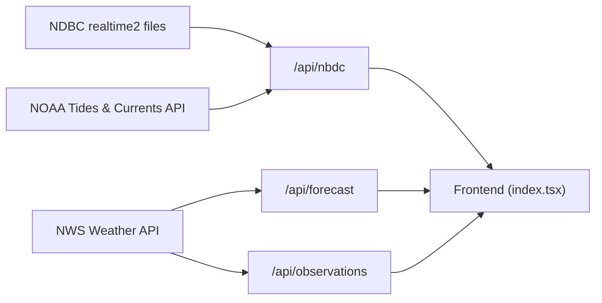

# NextWeather

[](https://app.netlify.com/sites/nextweather/deploys)

> Real-time wind and tide conditions for human-powered watercraft — kayakers, sailors, and paddleboarders.

NextWeather aggregates data from multiple NOAA APIs into a single, glanceable interface so you can check conditions before heading out on the water. Data refreshes automatically every 5 minutes.

## Features

- **Live wind observations** — speed, gust, and direction from NDBC buoy stations
- **Tide levels & predictions** — current water level plus upcoming high/low tides from NOAA Tides & Currents
- **Hourly forecast** — wind and weather forecast from the National Weather Service
- **Customizable stations** — query any NDBC or NWS station by ID
- **Responsive UI** — Chakra UI v3 with animated transitions via Framer Motion

## Architecture

```text
src/
├── pages/
│   ├── index.tsx              # Main dashboard (tabbed UI)
│   ├── _app.tsx               # ChakraProvider + global layout
│   └── api/
│       ├── nbdc.ts            # Wind + tide aggregator (primary endpoint)
│       ├── observations.ts    # NWS station observations proxy
│       └── forecast.ts        # NWS hourly forecast proxy
├── components/
│   ├── TabBar.tsx             # Tab navigation
│   ├── AboutTab.tsx           # About / info panel
│   ├── CustomTab.tsx          # Custom station selector
│   └── ForecastTab.tsx        # Hourly forecast display
└── util/
    ├── convert.ts             # Unit conversions (m/s → mph, °C → °F)
    ├── leading-zero.ts        # Zero-padding for date formatting
    └── nws-date-to-js-date.ts # NOAA date string → JS Date
```

### Data Flow



### API Endpoints

| Endpoint | Source | Description |
| --- | --- | --- |
| `/api/nbdc?station=WPOW1&tideStation=9447130` | NDBC + NOAA T&C | Wind speed/direction/gust, air temp, tide level & predictions |
| `/api/forecast?station=KSEA` | NWS | Hourly wind & weather forecast for a station |
| `/api/observations?station=KSEA` | NWS | Latest weather observations for a station |

### Tech Stack

| Layer | Technology |
| --- | --- |
| Framework | Next.js 16 (Pages Router) |
| UI | React 19, Chakra UI v3, Framer Motion |
| Language | TypeScript (new code) / JavaScript (legacy) |
| Charts | Recharts |
| Testing | Jest 30, React Testing Library, `next-test-api-route-handler` |
| Component Dev | Storybook 10 |
| Deployment | Netlify |
| Commit Standards | Commitizen + commitlint (Conventional Commits) |

## Getting Started

### Prerequisites

- **Node.js** ≥ 18
- **npm** ≥ 9

### Installation

```bash
git clone https://github.com/ivanoats/nextweather.git
cd nextweather
npm install
```

### Development

```bash
npm run dev
```

Open [http://localhost:3000](http://localhost:3000) to view the app. The page auto-updates as you edit files.

### Other Commands

```bash
npm test              # Run Jest test suite
npm run build         # Production build
npm run lint          # ESLint
npm run commit        # Commitizen interactive commit prompt
npm run storybook     # Storybook on http://localhost:6006
npm run build-storybook  # Static Storybook export
```

## Contributing

Contributions are welcome! Please follow these steps:

1. **Fork** the repository and create your branch from `main`.
2. **Install dependencies** — `npm install`.
3. **Make your changes** — write TypeScript for any new files.
4. **Add tests** — place them in `tests/` mirroring the source structure.
5. **Run the test suite** — `npm test` to make sure nothing is broken.
6. **Commit using Conventional Commits** — run `npm run commit` to use Commitizen, or format manually (e.g. `feat: add new station`, `fix: tide parsing`).
7. **Open a Pull Request** against `main`.

### Commit Convention

This project uses [Conventional Commits](https://www.conventionalcommits.org/) enforced by commitlint. Use the `npm run commit` helper for a guided prompt, or write messages like:

```text
feat: add support for wave height data
fix: handle missing tide predictions gracefully
docs: update API endpoint table in README
```

### Code Style

- **TypeScript** for all new source files (`.ts` / `.tsx`)
- **Prettier** for formatting
- **ESLint** with `eslint-config-next` and `eslint-config-prettier`

### Project Structure Conventions

- API routes go in `src/pages/api/`
- React components in `src/components/`
- Utility functions in `src/util/`
- Tests in `tests/` mirroring the source tree
- Storybook stories in `stories/`

## Data Sources

NextWeather relies on publicly available NOAA data:

- [**NDBC (National Data Buoy Center)**](https://www.ndbc.noaa.gov/) — realtime2 text files with 45-day wind/wave/temperature history
- [**NOAA Tides & Currents**](https://tidesandcurrents.noaa.gov/) — water level observations and tide predictions
- [**National Weather Service API**](https://www.weather.gov/documentation/services-web-api) — station observations and hourly forecasts

## License

This project is copyright 2026 Ivan Storck. See the repository for license details.

---

Built with ☕ for the paddling community.
