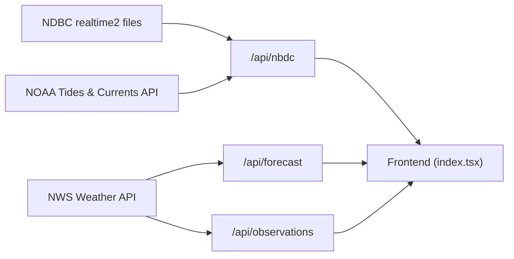

# NextWeather

[](https://app.netlify.com/sites/nextweather/deploys)

> Real-time wind and tide conditions for human-powered watercraft — kayakers,
> sailors, and paddleboarders.

NextWeather aggregates data from multiple NOAA APIs into a single, glanceable
interface so you can check conditions before heading out on the water. Data
refreshes automatically every 5 minutes.

## Features

- **Live wind observations** — speed, gust, and direction from NDBC buoy stations
- **Tide levels & predictions** — current water level plus upcoming high/low tides from NOAA Tides & Currents
- **Hourly forecast** — wind and weather forecast from the National Weather Service
- **Intelligent forecast summaries** — natural language weather descriptions with
  emoji-enhanced messages tailored for water sports enthusiasts
- **Wind speed visualization** — sparkline charts showing wind trends over the next 24 hours
- **Wind condition alerts** — automatic comparison of current vs. forecasted
  conditions with actionable recommendations
- **Customizable stations** — query any NDBC or NWS station by ID
- **Responsive UI** — Chakra UI v3 with animated transitions via Framer Motion
- **Comprehensive TypeScript types** — Fully typed API responses with exported types for external consumers
- **Server-side caching** — In-memory cache reduces latency and API load with intelligent TTL settings (see [Caching Documentation](docs/CACHING.md))

## Architecture

```text
src/
├── pages/
│   ├── index.tsx              # Main dashboard (tabbed UI)
│   ├── _app.tsx               # ChakraProvider + global layout
│   └── api/
│       ├── nbdc.ts            # Wind + tide aggregator (primary endpoint)
│       ├── observations.ts    # NWS station observations proxy
│       └── forecast.ts        # NWS hourly forecast proxy
├── components/
│   ├── TabBar.tsx             # Tab navigation
│   ├── AboutTab.tsx           # About / info panel
│   ├── CustomTab.tsx          # Custom station selector
│   └── ForecastTab.tsx        # Hourly forecast display
└── util/
    ├── cache.ts               # Server-side caching with TTL
    ├── convert.ts             # Unit conversions (m/s → mph, °C → °F)
    ├── forecast-summary.ts    # Natural language forecast generation
    ├── leading-zero.ts        # Zero-padding for date formatting
    └── nws-date-to-js-date.ts # NOAA date string → JS Date
```

### Data Flow



### API Endpoints

All endpoints implement server-side caching with appropriate TTL settings. See
[Caching Documentation](docs/CACHING.md) for details.

| Endpoint                                      | Source          | Description                                                   | Cache TTL  |
| --------------------------------------------- | --------------- | ------------------------------------------------------------- | ---------- |
| `/api/nbdc?station=WPOW1&tideStation=9447130` | NDBC + NOAA T&C | Wind speed/direction/gust, air temp, tide level & predictions | 5 minutes  |
| `/api/forecast?station=KSEA`                  | NWS             | Hourly wind & weather forecast for a station                  | 30 minutes |
| `/api/observations?station=KSEA`              | NWS             | Latest weather observations for a station                     | 5 minutes  |

#### API Implementation Details

The `/api/nbdc` endpoint uses `Promise.allSettled` for parallel data fetching:

- Fetches NDBC weather data, current tide, and tide predictions concurrently
- Accumulates errors without failing completely (partial data availability)
- Uses helper functions: `parseNdbcObservations()`, `parseValue()`, `fetchWeatherData()`, `getCurrentTide()`, `getNextTides()`

NDBC data parsing uses column index constants for the realtime2 space-delimited format:

```typescript
const NDBC_COLUMNS = {
  WDIR: 5, // Wind direction (degrees True)
  WSPD: 6, // Wind speed (m/s)
  GST: 7, // Wind gust (m/s)
  ATMP: 13, // Air temperature (°C)
} as const;
```

NWS API requests include a required User-Agent header:

```typescript
const NWS_USER_AGENT = 'NextWeather/1.0 (westpointwind.com)';
```

### Forecast Summary System

NextWeather includes an intelligent forecast summarization system that generates
natural language descriptions of wind conditions using a template-based approach
(no LLM required). This provides:

- **Zero-cost operation** — Template-based generation with no API costs
- **Instant response** — No network latency or rate limits
- **Predictable output** — Consistent, reliable messaging
- **Water sports focus** — Language and recommendations tailored for kayakers, sailors, and paddleboarders

#### Key Capabilities

**Wind Analysis:**

- Parses forecast periods to calculate average, min, and max wind speeds
- Detects sustained high wind conditions (3+ consecutive periods)
- Identifies gusty conditions when wind ranges exceed thresholds
- Provides emoji-enhanced descriptions matching enthusiasm to conditions

**Current vs. Forecast Comparison:**

- Compares forecasted conditions with real-time observations
- Generates contextual alerts when differences exceed 5 mph
- Warns about strong gusts (10+ mph higher than sustained wind)
- Adjusts messaging when current conditions are better/worse than forecast

**Weather Context:**

- Analyzes temperature trends and provides comfort descriptions
- Identifies dominant weather patterns (sunny, cloudy, rainy, stormy)
- Generates actionable recommendations based on conditions
- Includes safety warnings for severe weather

**Wind Speed Visualization:**

- Sparkline charts show 24-hour wind speed trends
- Visual display of wind variation throughout the day
- Helps identify optimal timing for water activities

Implementation: `src/util/forecast-summary.ts` with integration in `ForecastTab.tsx`

### Tech Stack

| Layer            | Technology                                                           |
| ---------------- | -------------------------------------------------------------------- |
| Framework        | Next.js 16 (Pages Router)                                            |
| UI               | React 19, Chakra UI v3, Framer Motion                                |
| Language         | TypeScript (new code) / JavaScript (legacy)                          |
| Charts           | Recharts                                                             |
| Testing          | Jest 30, React Testing Library, `next-test-api-route-handler`        |
| Component Dev    | Storybook 10                                                         |
| Deployment       | Netlify                                                              |
| Commit Standards | Commitizen + commitlint (Conventional Commits + Conventional Branch) |

## Getting Started

### Prerequisites

- **Node.js** 22.x (matches `.nvmrc`)
- **npm** ≥ 9

### Installation

```bash
git clone https://github.com/ivanoats/nextweather.git
cd nextweather
npm install
```

### Development

```bash
npm run dev
```

Open [http://localhost:3000](http://localhost:3000) to view the app. The page auto-updates as you edit files.

### Other Commands

```bash
npm test              # Run Jest test suite
npm run build         # Production build
npm run lint          # ESLint
npm run commit        # Commitizen interactive commit prompt
npm run storybook     # Storybook on http://localhost:6006
npm run build-storybook  # Static Storybook export
```

## Contributing

Contributions are welcome! Please follow these steps:

1. **Fork** the repository and create your branch from `main`.
2. **Install dependencies** — `npm install`.
3. **Make your changes** — write TypeScript for any new files.
4. **Add tests** — place them in `tests/` mirroring the source structure.
5. **Run the test suite** — `npm test` to make sure nothing is broken.
6. **Commit using Conventional Commits** — run `npm run commit` to use Commitizen, or
   format manually (e.g. `feat: add new station`, `fix: tide parsing`).
7. **Open a Pull Request** against `main`.

### Commit Convention

This project uses [Conventional Commits](https://www.conventionalcommits.org/)
enforced by commitlint. Branch naming is encouraged to follow the
[Conventional-Branch](https://conventional-branch.github.io/) pattern as a
recommendation (not currently CI-enforced). Use the `npm run commit` helper for
a guided prompt, or write messages like:

```text
feat: add support for wave height data
fix: handle missing tide predictions gracefully
docs: update API endpoint table in README
```

### Code Style

- **TypeScript** for all new source files (`.ts` / `.tsx`)
- **Prettier** for formatting
- **ESLint** with `eslint-config-next` and `eslint-config-prettier`

### Project Structure Conventions

- API routes go in `src/pages/api/`
- React components in `src/components/`
- Utility functions in `src/util/`
- Tests in `tests/` mirroring the source tree
- Storybook stories in `stories/`

## Continuous Integration

NextWeather uses GitHub Actions to maintain code quality and security:

### CI Workflow

Runs on every pull request and push to `main`:

- **Linting** — ESLint for JavaScript/TypeScript code style and Markdownlint for documentation
- **Type Checking** — TypeScript compilation without code generation (`tsc --noEmit`)
- **Testing** — Jest test suite with coverage for all API endpoints and components
- **Building** — Next.js production build validation

All jobs run in parallel for faster feedback.

### Dependabot

Automatically creates pull requests for dependency updates:

- **NPM packages** — Weekly updates for production and development dependencies
- **GitHub Actions** — Weekly updates for workflow actions
- **Grouped updates** — Minor and patch versions grouped to reduce noise
- **Auto-labeled** — PRs tagged with `dependencies` for easy filtering

### Pull Request Labeling

Automatically labels PRs based on changed files:

- `documentation` — Markdown files and docs
- `dependencies` — package.json changes
- `tests` — Test files
- `api` — API route changes
- `components` — React component changes
- `ui` — UI-related changes (components, styles, stories)
- `configuration` — Config file changes

### CodeQL Security Scanning

Runs weekly and on pushes/PRs to scan for security vulnerabilities:

- JavaScript/TypeScript analysis
- Automatic security alerts
- Integration with GitHub Security tab

## API Types

NextWeather provides comprehensive TypeScript types for all API responses:

### `/api/nbdc` Response Types

```typescript
type Observations = {
  stationId?: string;
  windSpeed?: number; // Converted to MPH
  windDirection?: number; // Degrees
  windGust?: number; // Converted to MPH
  airTemp?: number; // Converted to Fahrenheit
  currentTide?: string; // Current level
  nextTide?: string; // Next tide prediction
  nextTideAfter?: string; // Following tide prediction
};
```

### `/api/forecast` Response Types (Exported)

```typescript
export type ForecastPeriod = {
  startTime: string;
  endTime: string;
  windSpeed: string;
  windDirection: string;
  shortForecast: string;
  temperature: number;
  temperatureUnit: string;
  isDaytime: boolean;
};

export type ForecastResponse = {
  stationId: string;
  latitude: number;
  longitude: number;
  periods: ForecastPeriod[];
};
```

### `/api/observations` Response Types (GeoJSON-LD)

```typescript
interface WeatherValue {
  unitCode: string;
  value: number | null;
  qualityControl: string;
}

interface ObservationProperties {
  station: string;
  timestamp: string;
  temperature: WeatherValue;
  dewpoint: WeatherValue;
  windDirection: WeatherValue;
  windSpeed: WeatherValue;
  windGust: WeatherValue;
  // ... additional optional properties
}
```

## Data Sources

NextWeather relies on publicly available NOAA data:

- [**NDBC (National Data Buoy Center)**](https://www.ndbc.noaa.gov/) — realtime2 text
  files with 45-day wind/wave/temperature history
- [**NOAA Tides & Currents**](https://tidesandcurrents.noaa.gov/) — water level
  observations and tide predictions
- [**National Weather Service API**](https://www.weather.gov/documentation/services-web-api)
  — station observations and hourly forecasts

## License

This project is not currently licensed for public use or redistribution. All rights
reserved © 2026 Ivan Storck. If you are interested in using this code, please
contact the author to discuss licensing terms.

---

Built with ☕ for the paddling community.
